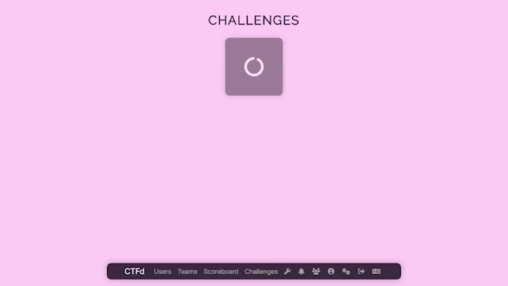
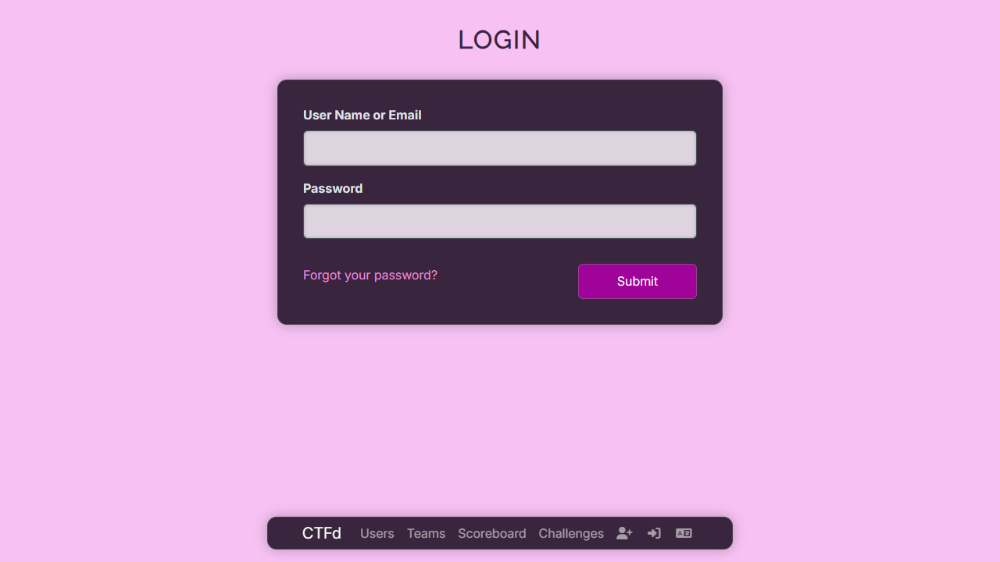
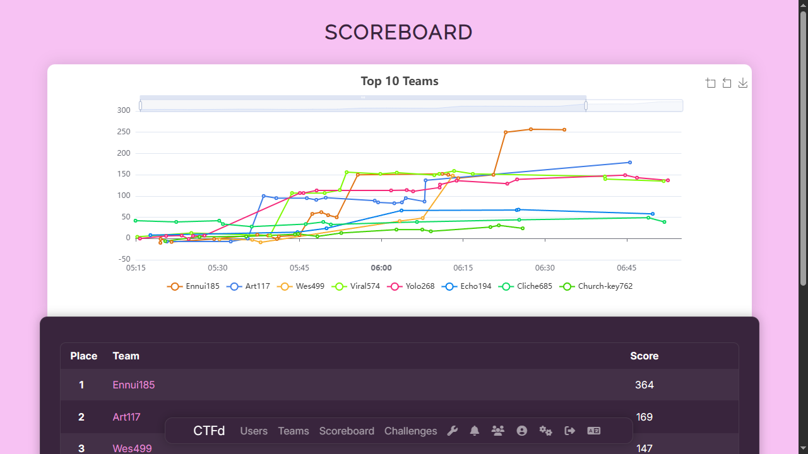
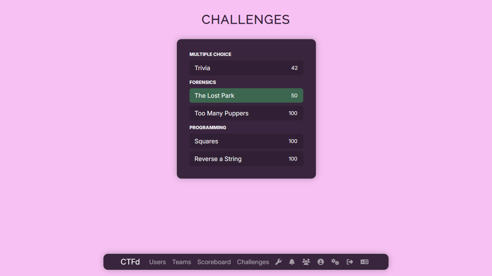
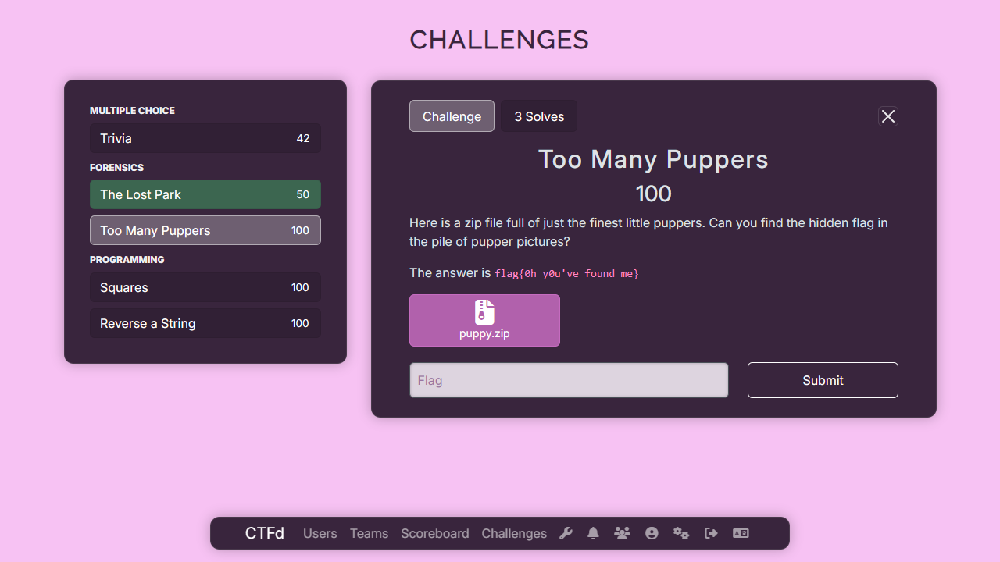
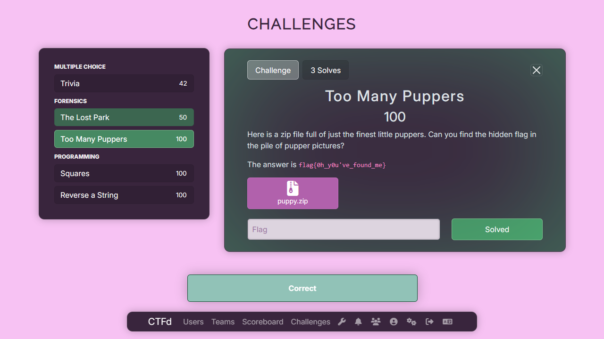
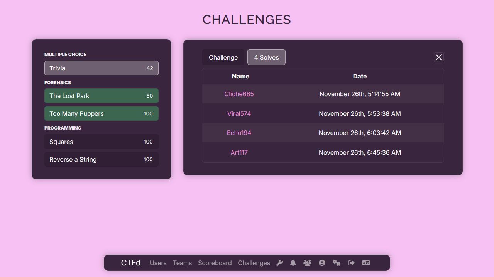
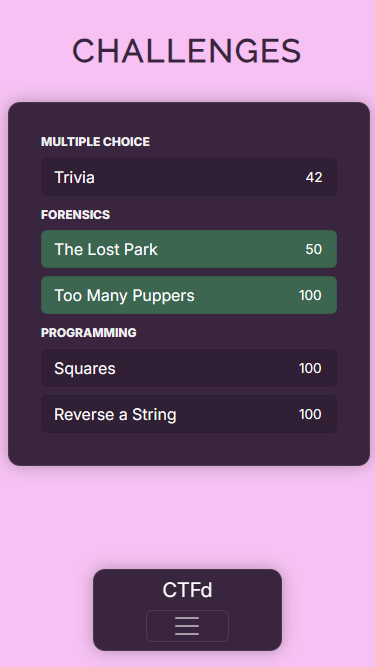
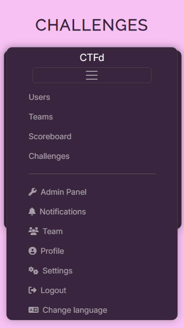
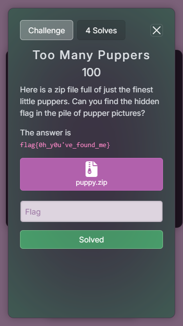

# Lingonberry
This is a sleek single-file CSS-only theme for CTFd I originally made for the ECSC Estonian finals. Feel free to modify and use it for your own CTFs.

## Features
- Sleek lilac-pink color scheme and design
  - Buttons and input elements
  - New animations
- CSS-only
- Floating navbar
  - CSS tooltips on icon hover
- Dual-panel challenge list
  - New loading animation
  - Challenges are shown in a compact list instead of a grid
  - Challenge shows up as a side-pane instead of as a modal
    - Fallback to modals for small/phone screens
  - Highlight currently selected challenge
    - This is achieved with a pretty silly CSS-hack
- Challenge pane/modal
  - Solved challenges show up as such
    - *Submit* button replaced with a green *Solved* button
    - The pane glows green
    - This is achieved with that pretty silly CSS-hack from earlier
  - File downloads now have an icon corresponding to the format
    - This is achieved with some CSS selector hackery and CTFd's fontawesome icon font
    - Supported file formats:
      - archives (zip, rar, gz, tar)
      - images (png, jpg, bmp, gif)
      - code (php, py, js, c)
      - text (txt)
      - pdf
      - if you need more file formats just add them yourself lol
    - Flag submission message now shows up as a toast
  - Mobile support (at least a bit)

## Screenshots
### Desktop
  
  
  
  
  
  
### Mobile
  
  
  

## Licensing
This theme has been released under the [MIT license](LICENSE). You are however allowed to use and distribute the CSS file without including the LICENSE file as long as you don't change/remove the CSS comment that links back to this GitHub page.
